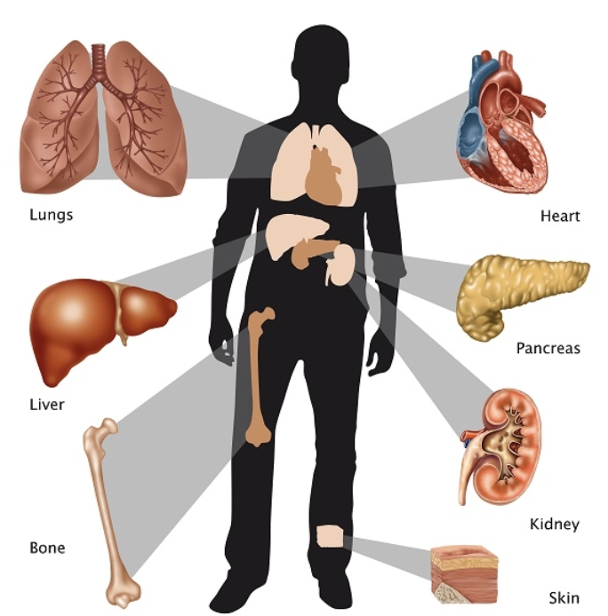
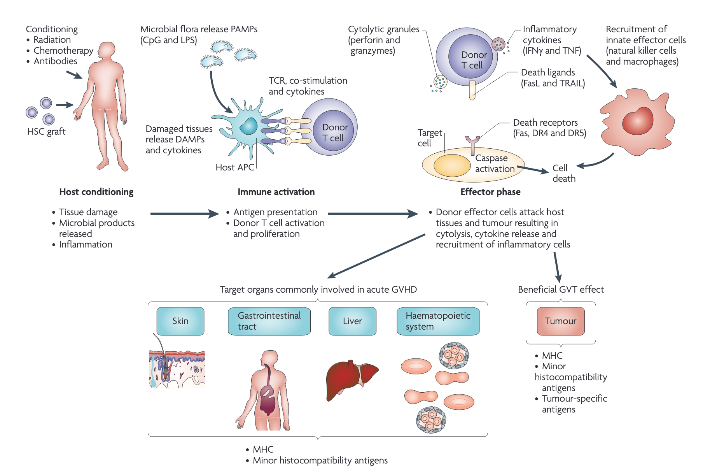
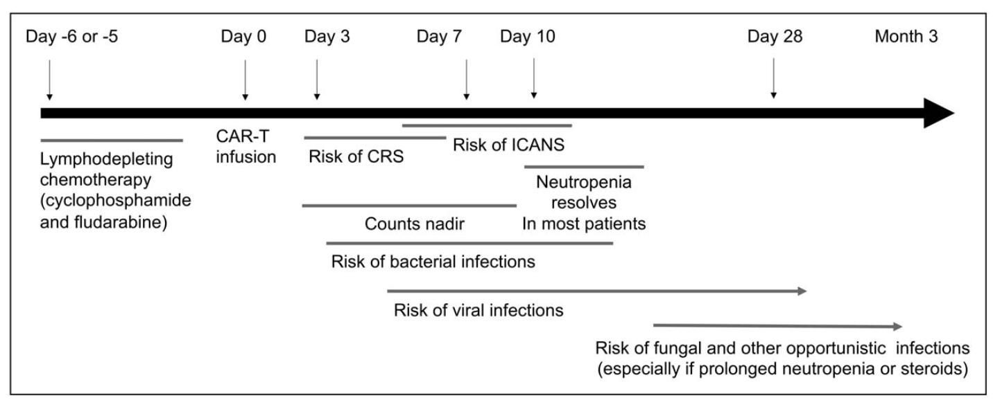
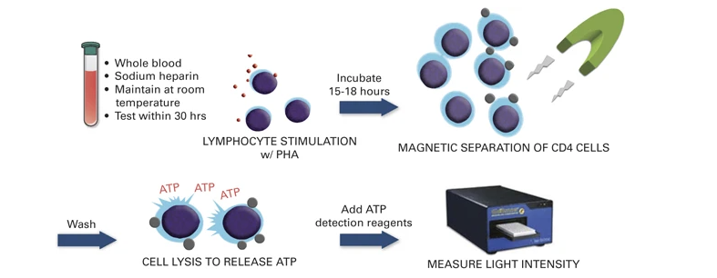
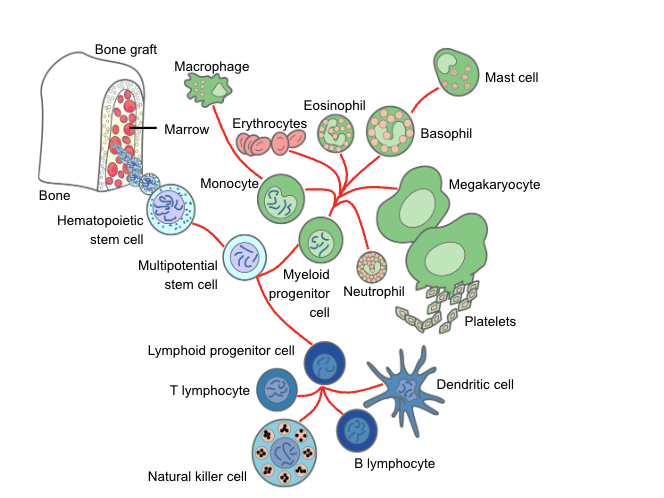
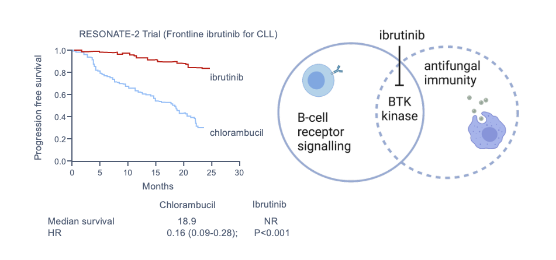
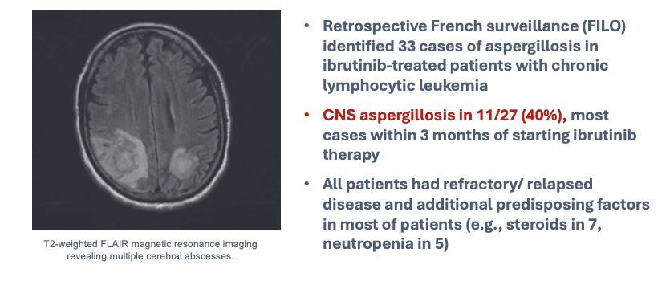
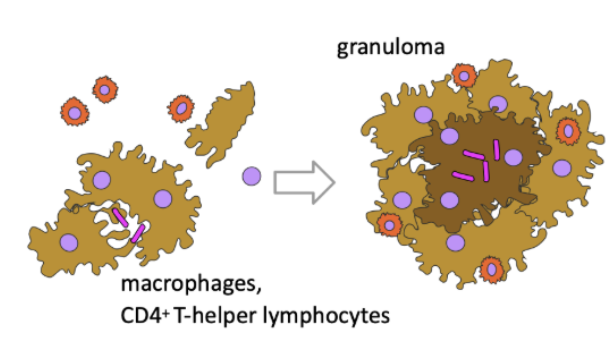
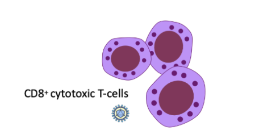
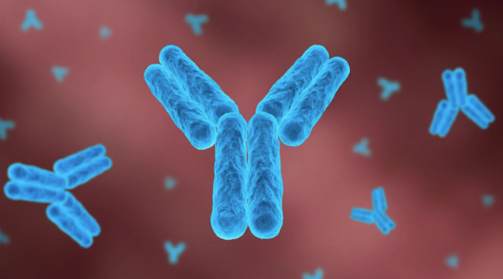

## Immununosuppression: <br>An Overview of Infection Risk {background-color="#9B0014"}

<br> <br>

<center>

Prof. Russell E. Lewis <br> Department of Molecular Medicine <br> University of Padua

<br>  russelledward.lewis\@unipd.it <br>  https://github.com/Russlewisbo

<br> slides available at: www.padovaid.com

</center>

|  |  |
|------------------------------------|------------------------------------|
| {width="150"} | {width="200"} |

# Introduction & Epidemiology {background-color="#9B0014"}

------------------------------------------------------------------------

## The growing population of immunocompromised hosts

<br>

-   **Estimated 5-6% of the Italian population** is immunocompromised [@Martinson2024]
-   **1%** of children fall into cohort of immunocompromised (VERDI project)
-   **2.8%** meet criteria for drug-induced immunosuppression [@Wallace2021]

::: notes
This is a rapidly growing population due to advances in transplantation, cancer therapy, and treatment of autoimmune diseases. The definition of "immunocompromised" varies significantly, which affects estimates.
:::

------------------------------------------------------------------------

## What causes immunocompromise?

<br>

**Major categories:**

-   Active treatment (chemotherapy) for malignancies
-   Solid organ transplant (SOT)
-   Hematopoietic cell transplant (HCT)
-   CAR-T cell therapy
-   Primary immunodeficiency
-   Advanced HIV infection
-   High-dose corticosteroids & biologics

# The net state of immunosuppression {background-color="#9B0014"}

## Defining net state of immunosuppression
<br>

<center>**A concept by Dr. Robert Rubin** (Massachusetts General Hospital-Harvard, Boston): <br> "Father" of transplant infectious diseases" </center>

{fig-align="center" width="300"}

"Composite of host factors, underlying disease, treatment, and other factors contributing to infection risk"

<br>

<br>

::: aside
This remains one of the most useful conceptual frameworks for thinking about infection risk in immunocompromised patients. It emphasizes that no single test can quantify immunosuppression—clinical judgment integrating multiple factors is required.
:::

## Components of the "net immunosuppresed state"

<br>

::::: {.columns style="justify-content: center;"}
::: {.column width="50%" style="text-align: center;"}
**Host Factors**

-   Advanced age
-   Malnutrition
-   Diabetes
-   Organ dysfunction
-   Hypogammaglobulinemia
:::

::: {.column width="50%" style="text-align: center;"}
**Treatment Factors**

-   Immunosuppressive drugs
-   Chemotherapy
-   Radiation
-   Surgery/hardware
-   Duration of therapy
:::
:::::

## Components (continued)

<br>

::::: {.columns style="justify-content: center;"}
::: {.column width="50%" style="text-align: center;"}
**Underlying Disease**

-   Autoimmune disease
-   Malignancy type
-   Organ failure stage
:::

::: {.column width="50%" style="text-align: center;"}
**Infectious Factors**

-   HIV, CMV, EBV status
-   Microbiome alterations
-   Prior infections
:::
:::::

# Infectious Complications & Mortality {background-color="#9B0014"}

## SOT Recipients
<br>

::::: columns
::: {.column width="50%"}
-   **6%** died from infection within first year (Swiss cohort) [@vanDelden2020]
-   **55%** had infections in first year (German renal cohort) [@Sommerer2022]
    -   Half occurred in first 3 months
    -   Bacteria: 66%, Viruses: 29%, Fungi: 5%
:::

::: {.column width="50%"}
{fig-align="center"}
:::
:::::

<br>

::: aside
SOT recipients face particular risks from surgical complications, hardware-related infections, and the combination of surgical stress plus immunosuppression in the early post-transplant period.
:::

## Hematopoetic stem cell transplantation (HSCT) recipients {.smaller}

<br>
<br>

| Type | Stem Cell Source | Donor | Immunosuppression |
|------------------|------------------|------------------|------------------|
| **Autologous** | Peripheral blood, Bone marrow | Self | Moderate; no GvHD prophylaxis required; recovery within weeks |
| **Allogeneic — matched related** | Peripheral blood, Bone marrow, Umbilical cord blood | HLA-matched sibling or family member | Severe; prolonged due to GvHD prophylaxis and risk of GvHD |
| **Allogeneic — matched unrelated (MUD)** | Peripheral blood, Bone marrow, Umbilical cord blood | HLA-matched unrelated donor (registry) | Very severe; higher GvHD risk than matched related; intensive prophylaxis |
| **Allogeneic — haploidentical** | Peripheral blood, Bone marrow | Half-matched family member (parent, child, sibling) | Very severe; requires intensive T-cell depletion or post-transplant cyclophosphamide |
| **Allogeneic — umbilical cord blood** | Umbilical cord blood | Unrelated cord blood unit | Very severe; delayed immune reconstitution due to low cell dose |

## Allogeneic hematopoetic stem cell<br> transplantation (HSCT) recipients

<br>

{fig-align="center" width="900"}

::: aside
<center>

-   Infection is **2nd leading cause** of mortality (after relapse) [@jenq2010]
-   First 100 days: **19-21%** mortality attributed to infection [@DSouza2018]
-   Long-term survivors (\>2 years): **30%** mortality from infection [@Norkin2019]

</center>
:::

## Timeline of Infection Risk

```{=html}
<iframe src="post_transplant_infections_light.html" width="100%" height="800px"></iframe>
```

## What is CAR-T therapy?

%20T%20Cell%20Therapy_%20Vein-to-Vein%20Process.png){fig-align="center" width="800"}

## Immunosuppression timeline with CAR-T

{fig-align="center"}

::: aside
CAR-T: Chimeric antigen receptor T-cell therapy; CRS-cytokine release syndrome; ICANS-Immune cell-associated neurological syndrome [@maus2020]
:::

## CAR-T cell therapy

<br>

-   Patients are **profoundly immunosuppressed**
-   Up to 1/3 suffer serious bacterial infection in first 30 days [@Stewart2021]
-   Cytokine release syndrome complicates assessment
-   Prolonged B-cell aplasia → hypogammaglobulinemia

# Measuring Immunosuppression {background-color="#9B0014"}

## Available Markers

<br>

::::: {.columns style="justify-content: center;"}
::: {.column width="50%" style="text-align: center;"}
**Useful in HIV:**

-   CD4 count
-   CD4 percentage
-   CD4/CD8 ratio
:::

::: {.column width="50%" style="text-align: center;"}
**General markers:**

-   Neutrophil count
-   Lymphocyte count
-   Immunoglobulin levels
:::
:::::

::: aside
Unfortunately, we lack reliable composite markers or algorithms to predict infection risk in most immunocompromised populations outside of HIV. Clinical judgment remains essential.
:::

## Emerging biomarkers

<br>

{fig-align="center" width="1200"}

-   **Viral reactivation** (EBV, CMV, TTV, BK) → correlates with immunosuppression
-   **QuantiFERON Monitor** → may identify over-immunosuppression
-   **ImmuKnow assay** → correlates with infection/rejection risk
-   Traditional markers (ESR, CRP, procalcitonin) → **NOT predictive**

<br> <br>

:::aside
PHA- Phytohemagglutinin (T-cell mitogen-polyclonal activation); 👉 ATP = proxy for T-cell activation strength
:::

# Sources of Infection {background-color="#9B0014"}

## Community-acquired pathogens

<br>

-   Most common infections **mimic community pathogens**
-   Immunocompromised patients are often "sentinel cases" in outbreaks
-   Respiratory viruses, GI pathogens
-   *Norovirus*, *C. difficile*

## Healthcare-associated pathogens

<br>

-   **Increased risk of MDR organisms** due to frequent healthcare contact
-   Catheter-related infections
-   Pneumonia
-   UTI

## Reactivation of latent infections

<br>

Key pathogens to screen for and monitor:

-   *Mycobacterium tuberculosis*
-   *Strongyloides*
-   Hepatitis B
-   *Coccidioides*, *Histoplasma*
-   *Trypanosoma cruzi* (Chagas)

## Donor-derived infections

-   Organ transplant
-   Stem cell transplant
-   Blood products
-   Usually within **first 6 months**
-   Most common infections:
    -   Cytomegalovirus
    -   Epstein-Barr virus (post-transplant lymphoproliferative disease)
    -   Herpes simplex and varicella zoster
    -   Hepatitis B,C
    -   HIV
    -   Bacterial infections
    -   Fungal infections (*Candida, Aspergillus*)

# Components of Host Defense {background-color="#9B0014"}

## Overview of immune system

<br>

::::: columns
::: {.column width="50%"}
**Innate Immunity**

-   Granulocytes
-   Monocytes/Macrophages
-   NK cells
-   Complement
-   Physical barriers
:::

::: {.column width="50%"}
**Acquired Immunity**

-   Cellular (T cells)
-   Humoral (B cells)
-   Antibody production
:::
:::::

## Granulocytes (neutrophils)

<br>

::::: columns
::: {.column width="50%"}
-   Chemotherapy & radiation → **neutropenia**

-   Duration: 3-4 weeks or longer

-   **Primary risk factor** for infection

-   Risk increases with:

    -   Depth of neutropenia
    -   Duration of neutropenia

-   Concurrent organ dysfunction
:::

::: {.column width="50%"}

:::
:::::

## Corticosteroid effects on neutrophils

<br>

**Paradoxical effects:**

-   ↑ Granulocytopoiesis (apparent benefit)
    -   BUT: ↓ Accumulation at infection site
-   ↓ Adherent capacity
-   ↓ Chemotaxis
-   ↓ Phagocytosis
-   ↓ Intracellular killing

## Monocytes & macrophages

<br>

-   **Monocytopenia** parallels neutropenia
-   Macrophage activation requires **T-cell cytokines** (IFN-γ)
-   Explains cellular immunodeficiency susceptibility
-   Targeted therapies can have **unexpected effects**

::: aside
Ibrutinib is a good example—designed as a BTK inhibitor for B cells, but has broader effects on macrophage function contributing to aspergillosis risk.
:::

## Ibrutinib

{fig-align="center" width="1600"}

## Unexpected fungal infections

{fig-align="center" width="1600"}

## NK cells and platelets

<br>

**NK Cells:**

-   Respond to viruses and malignancy
-   CD56 receptor → *Aspergillus* recognition
-   Dysfunction contributes to fungal susceptibility

**Platelets:**

-   Increasingly recognized immune role

-   Thrombocytopenia → independent bacteremia risk

-   Protection against yeast and molds

## Cellular immunity

<br>

**Drugs that impair T-cell function:**

-   Corticosteroids
-   Azathioprine, cyclosporine, tacrolimus
-   mTOR inhibitors (sirolimus, everolimus)
-   Purine analogues (fludarabine, cladribine)
-   Alemtuzumab

**Diseases:** Hodgkin lymphoma, CLL

## Targeted therapy risks

<br>

| Drug        | Mechanism          | Infection Risk       |
|-------------|--------------------|----------------------|
| Ruxolitinib | JAK-STAT inhibitor | TB, HBV reactivation |
| Ibrutinib   | BTK inhibitor      | Aspergillosis, PJP   |
| Idelalisib  | PI3K inhibitor     | *P. jirovecii*       |

<br>

If you see a drug ending in "mab" or "nib" or "sib" ....consider unique infection risk

::: aside
mab- monoclonal antibody-large protein biologic usually IV that binds extracellular targets (receptors, cytokines, cells); nib-small molecule inhibitor, usually oral- Enters cells and block intracellular signaling pathways;sib- signal inhibitor or nib-like drug
:::

## Humoral immunity

<br>

-   **B cells** → antibody-secreting plasma cells
-   Impaired in CLL, multiple myeloma
-   Rituximab, CAR-T → **B-cell depletion**
-   Profound, long-lasting hypogammaglobulinemia

**Splenectomy:** Loss of encapsulated bacteria defense-big 3

-   *Streptococcus pneumoniae*

-   *Haemophilus influenzae* type B

-   *Neisseria meningitidis*

<br>

Less common: *Capnocytophaga canimorsus, Salmonella spp. E. coli*

PSV and PPSV23 vaccine, MENACWY and MenB vaccine, HIB, Influenzae- Vaccinate 2 weeks before elective splenectomy or 2 weeks after emergency splenetocmy

# Physical Barriers {background-color="#9B0014"}

<br>

## The Integument

**Skin:**

-   Chemotherapy → hair loss, dryness
-   Catheters → direct microbial access
-   Broken skin → *S. aureus*, gram-negatives

**Oropharynx:**

-   Xerostomia + antibiotics → thrush, bacterial overgrowth

## Alimentary Tract

<br>

-   **Microbiome disruption** with antibiotics→ *C. difficile*
-   Mucosal barrier injury from chemotherapy
-   Facilitates bacterial translocation
-   With concomitant neutropenia allows progression to sepsis

# Immunodeficiency-Pathogen Associations {background-color="#9B0014"}

## Neutropenia: Gram-positive pathogens

<br>

-   Coagulase-negative staphylococci more common than <br> *Staphylococcus aureus* (most are from central venous catheter)
-   Viridans streptococci
-   Enterococci

## Neutropenia: Gram-negative pathogens

<br>

-   *Escherichia coli*
-   *Pseudomonas aeruginosa*
-   *Klebsiella pneumoniae*
-   *Enterobacter* spp.

## Impaired cellular immunity

<br> <br>

::::: columns
::: {.column width="50%"}
**Bacteria/Mycobacteria:**

-   *Listeria monocytogenes*

-   *Nocardia* spp.

-   *M. tuberculosis*

-   Nontuberculous mycobacteria

**Fungi/Parasites:**

-   *P. jirovecii*

-   *Aspergillus* spp.

-   *Cryptococcus* spp.

-   *Toxoplasma gondii*
:::

::: {.column width="50%"}
{width="800"}
:::
:::::

## Impaired cellular immunity (viruses)

<br> <br>

::::: columns
::: {.column width="50%"}
-   Herpesviruses (HSV, VZV, CMV, EBV)
-   Respiratory viruses
-   Polyomaviruses (BK, JC)
-   Human papillomavirus
:::

::: {.column width="50%"}
{width="800"}
:::
:::::

## Impaired humoral immunity

<br> <br>

::::: columns
::: {.column width="50%"}
-   *Streptococcus pneumoniae*
-   *Haemophilus influenzae*
-   *Neisseria meningitidis*
-   Norovirus
-   Hepatitis B virus
:::

::: {.column width="50%"}

:::
:::::

# Prevention Strategies {background-color="#9B0014"}

## Prophylaxis principles

<br>

**TMP-SMX for PJP** :typically 1 DS tablet daily also covers:

-   *Toxoplasma*
-   *S. aureus*
-   *Nocardia*
-   Many gram-positives/negatives

**Antiviral prophylaxis:** Val(acyclovir) for CMV (weak activity), HSV, VZV prevention. Valganciclovir or letermovir for higher risk CMV patients

::: aside
Problem with TMP/SMX- rash, GI upset, and cytopenias—often limits adherence. Can use - 1 DS tablet 3×/week (e.g., Mon–Wed–Fri) or even single-strength daily. Add folic acid if patient has anemia or leukopenia. Valganciclovir is assocaited with dose-limiting myelosuppression. Letermovir has fewer adverse effects but is more expensive
:::

## Patient education

<br>

**High-risk exposures to avoid:**

-   Gardening without protection (molds, *Nocardia*)
-   Poor dental hygiene (*Actinomyces*, bacteremia)
-   Marijuana smoking (*Aspergillus*)
-   Raw seafood (*Vibrio*)
-   Warm ocean swimming

# Key Takeaways {background-color="#9B0014"}

## Summary points

1.  **6% of population** is immunocompromised
2.  **Net state of immunosuppression** = composite assessment
3.  **First 100 days after transplant** = highest risk period
4.  **No single marker** predicts infection risk
5.  **Know pathogen associations** with specific defects
6.  **Prophylaxis** significantly alters risk profile

## Clinical Pearls

<br> <br>

::: callout-tip
## Remember

-   TMP-SMX provides broader coverage than just PJP prophylaxis
-   Timing matters—early vs late infections differ
-   Targeted therapies have unexpected infection risks
-   Consider the whole patient, not just the lab values
:::

## References

<br>
